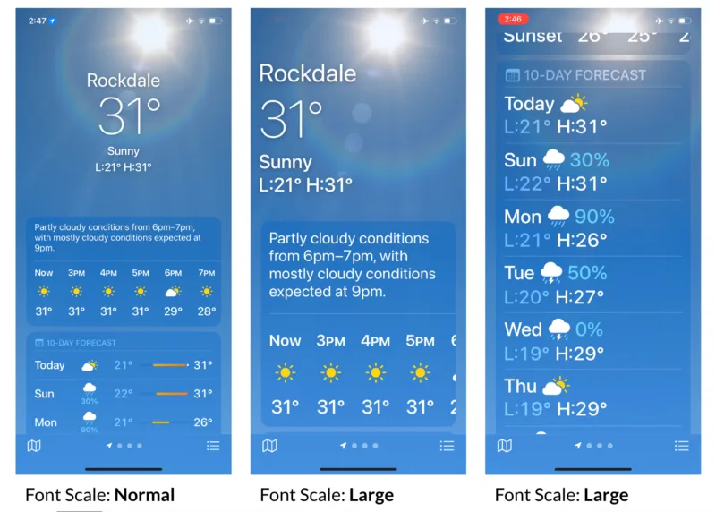
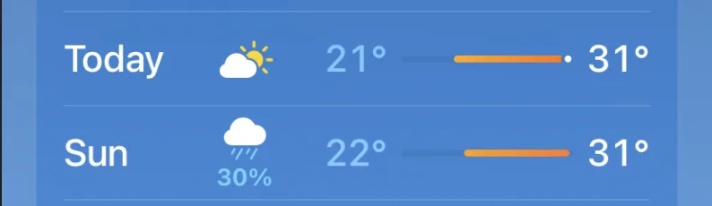
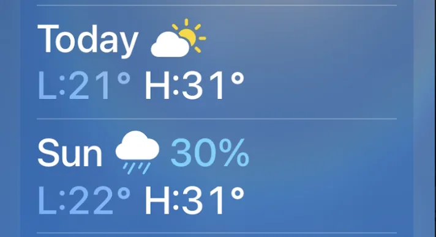
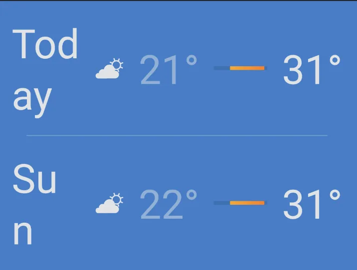
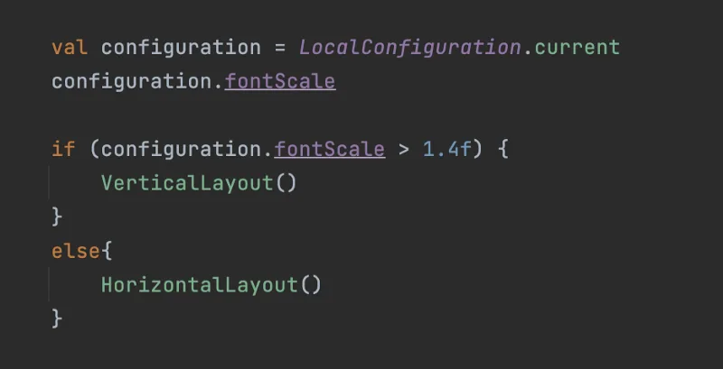
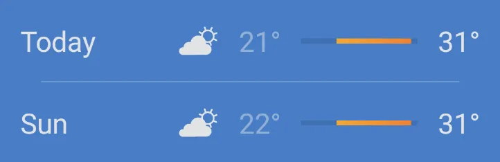
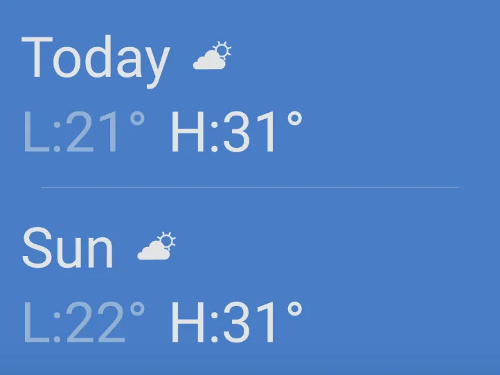
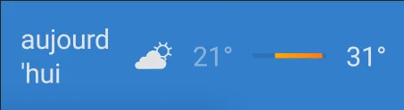
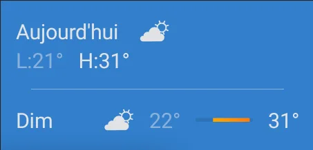

# 

Accessible Android Weather App: Jetpack Compose

As an application developer, it’s crucial to ensure that our app is accessible to all users, including those with visual impairments who require larger font sizes. This article takes inspiration from the accessibility behavior of the default iOS weather app to explore how it adapts when the font scale is increased. This not only helps individuals with visual impairments but can also aid in localization of the app.

We will delve into some of the components of the iOS Weather App and note our observations along with the technical approach required to achieve a similar user experience on android.

The goal of this article is to provide a reference for app developers and designers looking to create user-friendly experiences for individuals with visual impairments or to improve the user experience for all users.

Following are the screenshots from the iOS Weather app when the Font Scale is Normal and Large respectively.

## 

Component: DayTile()

### 

DayTile — Font Scale: Normal  
  
When the font size is normal (eg: 1.0 in android), then we can see following information in the list item:

  

1.  Day of the Week (Today, Sun etc.)
    
2.  Icon for cloudy / sunny etc. No matter the size of day’s text, the start position of icon remains same through out the list. Consistency rules.
    
3.  Precipitation % if rainy.
    
4.  Minimum and Maximum temperature of the day.
    
5.  Temperature Bar with colors.
    

### 

DayTile — Font Scale: Large

When the font size is increased to large, the following information is provided.

1.  Day of the Week (Today, Sun etc.)
    
2.  Icon for cloudy / sunny etc.
    
3.  Precipitation % if rainy.
    
4.  Minimum and Maximum temperature of the day.
    

Note that the temperature bar may not be displayed if there isn’t enough horizontal space. A prefix is added to the minimum and maximum temperature to add more meaning to the numbers, allowing users to understand the temperature range without relying on the temperature bar.

## 

What not to do ?

To avoid displaying text spread across multiple lines, it’s important to create an alternate layout for larger font sizes. Ellipsize the text using … is also not a good approach because it may hide crucial information. Since this is a weather app therefore, it’s essential to display the information correctly regardless of screen size, font scale, or device locale (language and region).

This problem may also occur if we are using a foldable device in the folded state even when the font size is normal (1.0). Or, it could also happen for a Mobile device, when the text is too big because the language of text might make it longer.

The word “summary” in German language is called “Zusammenfassung”

## 

How to fix / Initial Approach: Hard switch at Font Scale threshold

We can perform a hard switch between vertical and horizontal layout in order to display the alternate layouts. We ensure that at large font sizes, the text information will always be displayed properly in a consumable fashion. Following is a very simple code for this which displays the Vertical or Horizontal verison of the layout depending upon the fontScale value.

Android — DayTile (FontSize is 1.0)

Android — DayTile (FontSize is 1.4)

This solution works great, however, there is still a room for improvement.

Imagine the following device configuration:

1.  Device: Foldable (Folded State)
    
2.  Device Width: 330dp
    
3.  Font Size: 1.0
    
4.  Device Locale: French
    

The initial approach was to perform a hard switch between vertical and horizontal layout. However, this may still break the layout if the device width is smaller or if the text length varies for different languages.

## 

2nd Approach: Measure Layout

Another approach could be to measure the layout and then make a decision to switch between vertical and horizontal orientation. Let’s recall the point 2 from Observation section:

The start position of the weather icon should always be same for all the Horizontal layouts. Also, all the layouts must be displayed in single orientation, either vertically or horizontally to maintain consistency throughout the app.

The approach of measuring layout, will break the consistency of the app by having some items in the list displayed vertically while others are displayed horizontally. This is inconsistent and certainly not a good UX.

DayTile — In French language.

## 

How do we fix the inconsistency problem ?

We tried two approaches so far:

1.  Hard Switch at Font Size threshold.
    
2.  Measure layout.
    

We have observed that none of the two solutions mentioned above are accurate enough to solve this problem for all use cases of device locale, font size and screen size.

However, if we use a mix of these two approaches, we may be able to cater to a near perfect solution (Nothing is perfect.) to build a great UI which caters to all users.

## 

Defining a new approach:

1.  Make a hard switch at a certain font size threshold.
    
2.  However, for font size less than threshold, measure the layout and if at least one of the items is measured to display the layout in vertical orientation then all the items in list must be displayed in vertical orientation only.
    

This is a mixed solution based on the above two approaches and ensures that we achieve a consistent and user friendly experience for all device configurations.

This is not an easy solution to implement, as it involves measuring of the layout and then applying constraints as per certain calculations. However, it is important to go an extra mile or two to provide our users with the best UX.

## 

Conclusion

Not every user is the same.

We must strongly abide by this quote because:

1.  Some users might use the app at font size 1.0 , however others may choose 1.5, 2.0 or even go below 1.0 up to 0.7 to use their device.
    
2.  Others may use the application in a completely different language and the size of the text may be larger or shorter depending upon the language as well.
    
3.  With newer technologies like Foldable devices, the screen width may be smaller or larger depending upon the state of the device.
    

Therefore, it is important to ensure that the user interface elements in the app are displayed in a way that is easy for all users to understand. When the font size is increased, it may not be possible to display text and items horizontally. In such cases, it is important to display the items vertically while keeping consistency in mind. This makes it easier for users to read and understand the information in the app.

In the next post we will analyse another component in the iOS Weather app and try to find an optimal solution.

Feb 2023 - Karan Sharma

Page updated

Google Sites

Report abuse
