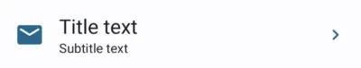
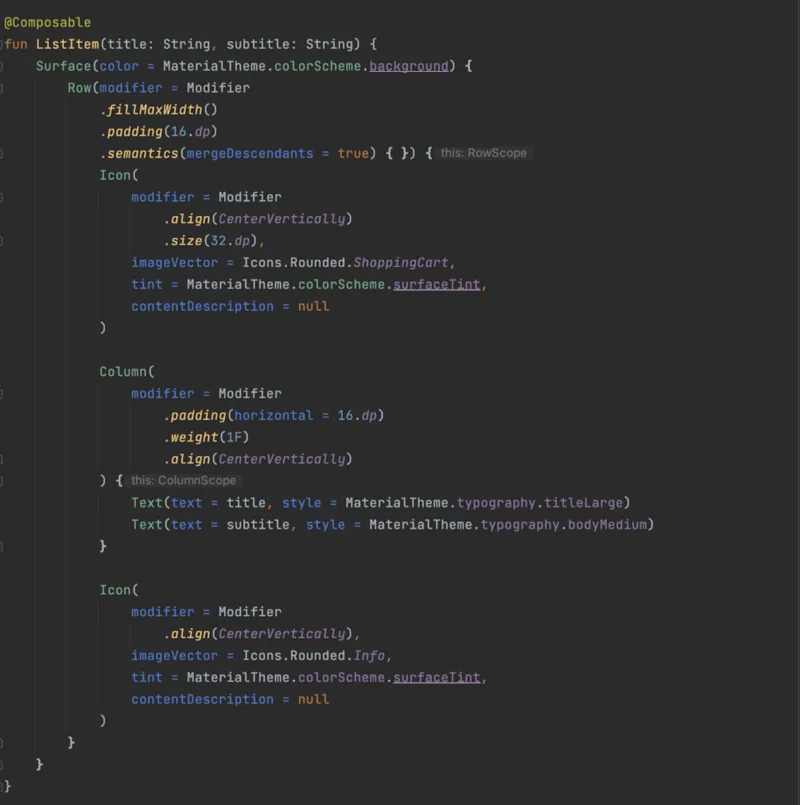
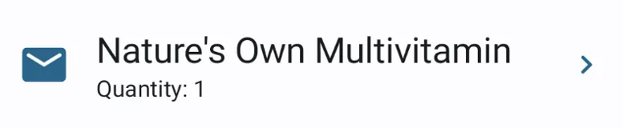
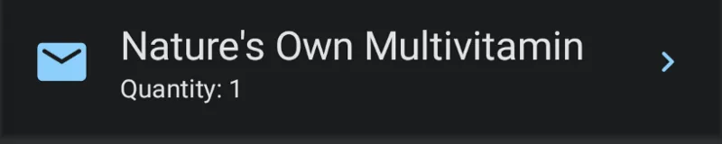
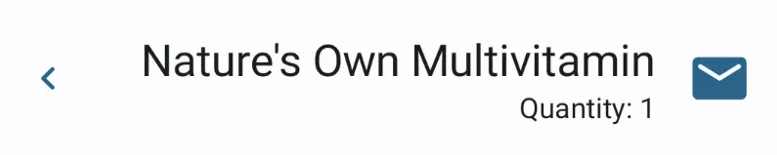
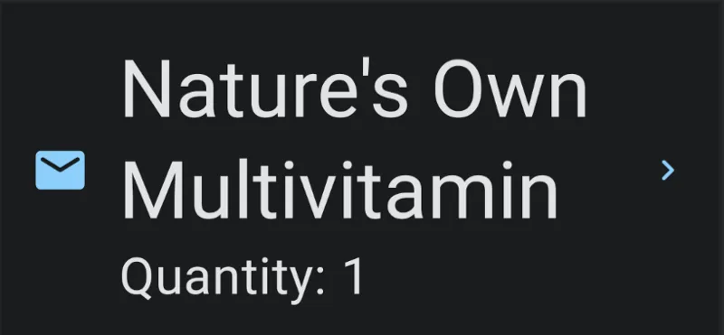

Today, we will create an accessible list item component in android using Jetpack Compose. We will support RTL Languages and Dark Mode as well using Material Design.

In most mobile applications, there is a common list element layout which has a left icon, a title, a subtitle and a right icon. This UI element is generally a part of a list. Sounds very common isn’t it ? And it is very easy to create one. For example, let's imagine the following design layout received as part of Figma layout. The developers may usually interpret the layout in their own terms.

There are following open questions a developer must ask to understand the behaviour of layout in following conditions:

- When the font scale is increased from 1.0 to 2.0
- When the locale is changed from LTR language English to an RTL language such as Arabic.
- When the title text is larger in length that it can no longer fit in the given width even for font scale = 1.0
- How does the UI behave in Dark Mode ?
- Assuming that the entire item is clickable then what should be the color of focus indicator ?
- What is the behavior when Talkback accessibility service is enabled ?

These are all very important questions an engineer need to ask before starting the development work in order to build a beautiful layout. Seems not so simple now is it ? No worries let’s go through each of the questions and we’ll find that at-least some of them have a very simple solution.

In this post we’re only concentrating on Jetpack Compose, however similar techniques can be applied with View based layouts as well, though am not advocating that it would be as simple as Compose UI, therefore I would recommend to switch to Jetpack Compose.

Alright then we’re ready to get onto answering those very fundamental questions about the design.

1. When the font scale is increased from 1.0 to 2.0

The title text and the subtitle text should not overlap each other and also, they must not overlap with the other icons. Therefore, they must have a safe space to grow. We can figure out that we will run out of the available width once the text reached the right icon, therefore the text must grow vertically. Another approach would be to trim the text with an ellipsis (…).

However, I’m not a fan of ellipsis as it hides the text and it becomes really challenging for the user to understand the information if it is not even available in the next screen when we click on this list item.

2. When the locale is changed from LTR language English to an RTL language such as Arabic.

If the user has selected an RTL Language for the device, then the application must respect it and the layout / list item must draw itself from right to left instead of left ot right. This is quite simple to achieve as we use start and end paddings. This was a bit confusing in the View based layouts as the paddings could also be specifically applied only to the left / right hand side, in which case the layout will not respect the LayoutDirection of device.

3. When the title text is larger in length that it can no longer fit in the given width even for font scale = 1.0

This use case is similar to the Q1 above.

4. How does the UI behave in Dark Mode ?

If the application design system supports dark mode, which means the colors for theme are defined for light mode and dark mode separately, then this is not a problem as the Design Team has already solved it for you. However it is advised to make sure the foreground to background color ratio satisfies WCAG AA / AAA standard ratios.

In the case of no dark theme support from the design system , as an engineer, you must push for the Dark Mode support in your design system as most of the users prefer to use their device in Dark mode rather than Light Mode, therefore, if your app supports it, it will be rated highly among it’s users and add to the success and popularity of the app among it’s users.

5. Assuming that the entire item is clickable then what should be the color of focus indicator ?

Focus indicators are quite useful from an accessibility perspective. If a user is using an external keyboard or a switch device to navigate through the app then focus indicators indicate the currently selected UI element.

Since this is a color related question again, it is best if it is driven from the design system created by the Design / UX team. However, if there is no proper guidance, we can refer how MaterialTheme handles it using the[Indication](https://developer.android.com/reference/kotlin/androidx/compose/foundation/Indication). You can also check[Compose Foundation API’s](https://android.googlesource.com/platform/frameworks/support/+/refs/heads/androidx-main/compose/foundation/foundation/src/commonMain/kotlin/androidx/compose/foundation/Indication.kt#159) for reference.

6. What is the behavior when Talkback accessibility service is enabled ?

Ideally if the entire element is clickable, then it must be merged together into a single node for Talkback. We can achieve this by using[semantics](https://developer.android.com/jetpack/compose/semantics) modifier. Checkout this section on android Developers about about[merging](https://developer.android.com/jetpack/compose/semantics#merged-vs-unmerged) layout element into a single one.

In the code below, we achieve this using Modifier.semantics (mergeDescendants = true) {}. This will ensure that, we receive single focus on the entire ListItem when talkback is on and all the text is announced together instead of different focus elements..

## Code

### Light Mode

### Dark Mode

### RTL (Right to Left) Mode

### Large Font Size (2.0)

Notice that the direction of the arrow in the RTL layout has also changed. We can achieve this by either using a different icon as per the layout direction or using the[rotate modifier](https://developer.android.com/reference/kotlin/androidx/compose/ui/Modifier#%28androidx.compose.ui.Modifier%29.rotate%28kotlin.Float%29), as well in this particular case.

val layoutDirection = LocalLayoutDirection.current

imageVector = if (layoutDirection == LayoutDirection.Ltr) Icons.Rounded.KeyboardArrowRight

else Icons.Rounded.KeyboardArrowLeft
