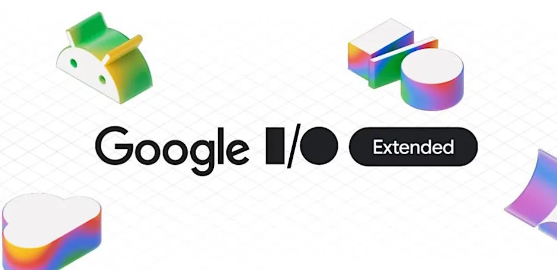

Compose Multiplatform to the City

# 

Compose Multiplatform to the City - KRAIL

Hello from Sydney! In this post, I’ll walk you through how I used Compose Multiplatform to build a real world, cross-platform public transport app called KRAIL for Android and iOS. This project was part of my talk at Google I/O Extended 2025 (Brisbane).

KRAIL App is available on both Google Play and Apple App Store.  
  

-   Android - [https://play.google.com/store/apps/details?id=xyz.ksharma.krail](https://play.google.com/store/apps/details?id=xyz.ksharma.krail)
    
-   iOS - [https://apps.apple.com/us/app/krail-app/id6738934832](https://apps.apple.com/us/app/krail-app/id6738934832)
    

## 

Goal

I wanted to build an app that:

-   Shares UI and logic across Android and iOS.
    
-   Lets users search for locations and see real-time transport info.
    
-   Stores frequent trips locally via a shared database layer.
    
-   Supports themable UI including dark mode.
    
-   Collects analytics and logs crashes.  
      
    

## 

Why Compose Multiplatform?

[JetBrains Compose Multiplatform](https://github.com/JetBrains/compose-multiplatform) is a modern framework that allows you to write declarative UI once in Kotlin and run it on Android, iOS, desktop, and even web. The shared code lives in the commonMain module, while platform-specific code goes in androidMain and iosMain.

This project used:

-   Kotlin/JVM for Android
    
-   Kotlin/Native for iOS
    
-   Compose UI in shared Kotlin
    
-   SwiftUI/UIViewController wrappers on iOS to host the Kotlin UI
    

## 

Project Structure Breakdown

-   The composeApp module holds all the shared logic and UI.
    
-   iosApp is an Xcode project that imports the shared Kotlin framework and wraps it using SwiftUI (ContentView.swift), and UIViewControllerRepresentable.  
      
    

The Android and iOS apps both call into KrailApp(), our main Compose entry point, with platform-specific setup code for DI using Koin.

## 

Android Compilation Flow

1.  Kotlin code is compiled into Java bytecode.
    
2.  Bytecode is transformed into DEX format.
    
3.  DEX is bundled into an APK.
    
4.  Installed on device via ART (Android Runtime).  
      
    

## 

iOS Compilation Flow

1.  Kotlin code is compiled to LLVM IR via Kotlin/Native.
    
2.  LLVM IR is turned into native ARM64 code.
    
3.  That code is packaged into a .framework or static library.
    
4.  Used by Xcode and launched on device no JVM involved.
    

## 

Networking with Ktor

For making HTTP requests, I used Ktor, a Kotlin-native library. It supports multiple platforms via engine abstraction:

-   Darwin for iOS (iosMain)
    
-   OkHttp for Android (androidMain)  
      
    

I define a shared expect function for the HTTP client, and provide actual implementations per platform.

// Shared

expect fun httpClient(): HttpClient

// Android

actual fun httpClient(): HttpClient = HttpClient(OkHttp) { ... }

// iOS

actual fun httpClient(): HttpClient = HttpClient(Darwin) { ... }

  

We can use ContentNegotiation with either JSON or Protobuf depending on the backend, and Ktor handles deserialization into data classes. We can use kotlinx serlialization library for serilaization / deserialization purposes.

## 

Local Storage with SQLDelight

In order to save frequent trips, we need to use a multiplatform library for storage and I chose SQLelight for this. It works well for both Android and iOS. SQLDelight stands out because it generates type-safe Kotlin APIs directly from .sq SQL files, ensuring compile-time safety and reducing runtime errors. Room also got multiplatform support recently, however, here are some reasons why I prefer SQL Delight.

1.  Type-safe APIs: By writing SQL in .sq files (e.g., SavedTrip.sq), SQLDelight generates Kotlin interfaces and data classes, so you interact with your database using strongly-typed code.
    
2.  Coroutines and Flow support: Database operations can be performed asynchronously and reactively, making it easy to update the UI as data changes.
    
3.  Delightful migrations: Schema changes are managed with versioned SQL scripts, and there’s no annotation or reflection overhead as seen in libraries like Room.
    
4.  Multiplatform drivers: SQLDelight works seamlessly across platforms. For example, AndroidSqliteDriver is used on Android, while NativeSqliteDriver is used on iOS. Using expect and actual mechanism it was quite easy to provide different driver for different platforms.
    

Code Example:

Write your SQL in a .sq file, such as:  
  
insertOrReplaceTrip:

INSERT OR REPLACE INTO SavedTrip(

tripId, 

fromStopId, 

fromStopName, 

toStopId, 

toStopName, 

timestamp

)

VALUES (?, ?, ?, ?, ?, datetime('now'));

SQLDelight generates a Kotlin APIs for us, so we can get the queries object from the Database object and the directly execute the SQL statement using Kotlin code. this is pretty cool.

private val db \= Database(factory.createDriver())

  

private val query \= db.databaseQueries

  

query.insertOrReplaceTrip(

   tripId,

   fromStopId,

   fromStopName,

   toStopId,

   toStopName,

)

The correct driver is provided per platform, ensuring smooth multiplatform support.

## 

Theming and Design System

I intentionally chose not to use the Material 3 library. Instead, I built the TAJ design system directly on top of Compose’s foundational APIs. For example, instead of using the Material TextField, TAJ uses the low level BasicTextField to create custom input components.

The core of TAJ consists of KrailColors and KrailTypography, which define the color palette and typography styles for the app. These are provided to composables via CompositionLocalProvider, enabling consistent theming and automatic support for light and dark modes. This approach gives full control over the UI, avoids dependencies on evolving libraries, and ensures a consistent look and feel across platforms.:

-   KrailColors
    
-   KrailTypography
    

All are injected into the composables via CompositionLocalProvider, and support light/dark themes automatically.

## 

Crash Monitoring & Analytics

To improve reliability and product insights:

-   Firebase Crashlytics for Android and iOS using [GitLive](https://github.com/GitLiveApp/firebase-kotlin-sdk)
    

We can also tracked:

-   App startup time
    
-   API success/failure rates
    
-   User behavior (popular stops, flows)
    

This data helped optimize the app and prioritize features.

## 

Live Demo

I wrapped up the session with a demo across:

-   Android (intro flow, search, large font support)
    
-   iOS (saved trips, theme switching)
    
-   Desktop (reusing the same Compose code!)
    

The app KRAIL is open-source and available [on GitHub](https://github.com/ksharma-xyz/KRAIL).

## 

Conclusion

Compose Multiplatform has evolved quickly, and it’s ready for real-world apps. With strong tooling, predictable compilation, and first-class multiplatform libraries like Ktor and SQLDelight, it’s an exciting time to build UIs for every screen using just Kotlin.

Whether you’re a solo dev or scaling for teams, you can now design, code, and ship delightful cross-platform apps with one shared mindset and language.

  
by Karan Sharma - 7 June 2025

Compose Multiplatform to the CITY - Google I/O Extended

Page updated

Google Sites

Report abuse
