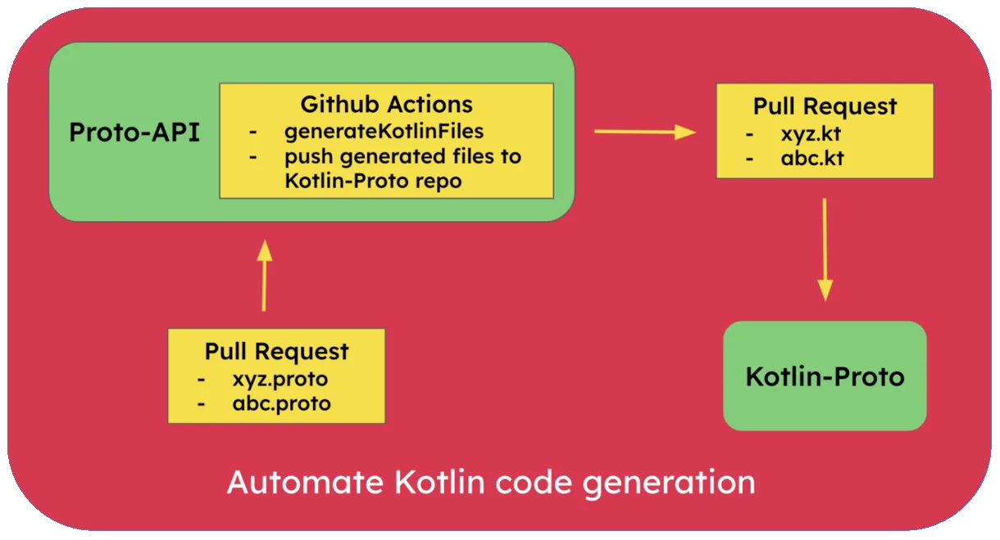

> “Protocol Buffers are language-neutral, platform-neutral extensible mechanisms for serializing structured data.” -[https://protobuf.dev/](https://protobuf.dev/)

Imagine your organization is developing applications for iOS, Android, Desktop, and Web platforms. Each of these platforms will need to display similar data, which often requires complex data structures and frequent updates. Maintaining consistency across all platforms can be challenging and time-consuming. This is where we can use Protocol Buffers (Protobuf or Proto) to build robust infrastructure for the engineering teams.

[Protobuf](https://protobuf.dev/) was developed by Google. It is a language-neutral, platform-neutral, extensible mechanism for serializing structured data. It allows you to define the structure of your data once and use it across various platforms and languages, ensuring consistency and efficiency. The data structure is defined in a file type called .proto. From this proto file, we can automatically generate code for different languages such as C++, C#, Python, Java, Kotlin, Objective C and even Swift. This means strongly typed data structures defined by the backend engineering team can be used by both iOS (Obj. C / Swift) and Android (Java / Kotlin) platforms.

### Advantages of using Protobuf

Let’s look at some benefits of using Protobuf over REST API’s (json).

- Efficient network layer Protobuf's help ensure your app requests resources from the server efficiently, with clear definitions provided by compact and efficient message formats. Smaller message sizes mean faster transmission times, which inherently improves network performance, reliability and also reduces engineering maintenance effort.

Imagine you're sending information between apps, like a grocery list. Protobufs will take up less space. This means the information will travel faster and use less network bandwidth. This makes our apps work better because they don't have to spend as much time or data sending information back and forth.

- Schema Enforcement Protobuf enforces strict schema definitions, and has strict data type enforcement. Therefore, we prevent any discrepancies and runtime errors during data exchange between services and applications. Our engineering infrastructure becomes robust and we can build reliable systems. Imagine you're packing gift boxes for different friends. Protobufs are like a packing list that says exactly what can go in each box. There is no more confusion, whether your friend receives an Integer or a String, a BigDecimal or a Float, a nullable or a non null element.
- Backward Compatibility:

Protobuf supports backward compatibility, allowing changes to the data schema without breaking existing clients. New fields can be added, and old fields can be deprecated, ensuring that older clients can still parse and understand the updated data structure. This flexibility facilitates seamless updates and evolution of the data model, maintaining interoperability across different versions of the application. Imagine you're building a fitness app that tracks user workouts. Initially, the network layer data has fields like duration and distance.

Scenario 1: Adding a new field

As the app progresses and new features are added, say you add a "calories burned" field. With Protobuf's backward compatibility, older app versions still process the data without recognizing the new field.

Scenario 2: Deprecating a Field

If we later on decide to use gps location coordinates in favor of distance field. Protobuf lets older app versions continue using "distance" while newer versions can switch to "GPS coordinates" seamlessly.

- Language Independence: Protobufs act as a bridge between different platforms and teams. They ensure data consistency across the organization, regardless of the programming language engineering teams choose. This empowers teams to work independently with their preferred languages while still maintaining seamless communication and compatibility. The valuable time otherwise spent on ensuring compatibility and communication among teams is now freed for teams to focus on innovation and building even better solutions.

For e.g. in Android development, we used to build apps using Java and now everyone uses Kotlin, it’s relatively easier to migrate when using protos. Similarly for iOS if you’re migrating from Objective C to Swift, it is relatively easier too.

### [Wire](https://square.github.io/wire/)

In this post we will focus on Android Development and see how to generate Kotlin code from Protobuf files and automate the process using GitHub Actions. We will use a library called Wire, which is developed by Square.

For each message type defined in the schema, Wire generates an immutable model class and its builder. The generated code looks like code you’d write by hand: it’s documented, formatted, and simple. Let’s see how to do this. For detailed documentation refer:[https://square.github.io/wire/wire_compiler/](https://square.github.io/wire/wire_compiler/)

Protobuf File A sample protobuf file user.proto defining an id, name and age which are strongly typed values as string and integer respectively.

```protobuf
syntax = "proto3";

option java_package = "xyz.ksharma.user";
option java_outer_classname = "User";

message User {
  string id = 1;
  string name = 2;
  int32 age = 3;
}
```

Add Wire gradle plugin

```kotlin

// In libs.versions.toml
wire = { id = "com.squareup.wire", version.ref = "wire"}

// In build.gradle.kts (module level)
plugins {
    alias(libs.plugins.wire)
}

wire {
    kotlin {
        javaInterop = true
        out = "$projectDir/build/generated/source/wire"
    }
    protoPath {
        srcDir("src/main/proto")
    }
    sourcePath {
        srcDir("src/main/proto")
    }
    // For complete Kotlin configuration refer: https://square.github.io/wire/wire_compiler/#kotlin 
}
```

The gradle plugin will add two tasks which can generate Kotlin classes.

- generateProtos
- generateMainProtos

Generated Kotlin Class

After running the gradle task, following Kotlin class is created.

```kotlin
// Code generated by Wire protocol buffer compiler, do not edit.
// Source: User in xyz/ksharma/pokemon/user.proto
@file:Suppress("DEPRECATION")

package xyz.ksharma.user

import com.squareup.wire.FieldEncoding
import com.squareup.wire.Message
import com.squareup.wire.ProtoAdapter
import com.squareup.wire.ProtoReader
import com.squareup.wire.ProtoWriter
import com.squareup.wire.ReverseProtoWriter
import com.squareup.wire.Syntax.PROTO_3
import com.squareup.wire.WireField
import com.squareup.wire.`internal`.JvmField
import com.squareup.wire.`internal`.JvmSynthetic
import com.squareup.wire.`internal`.sanitize
import kotlin.Any
import kotlin.Boolean
import kotlin.Int
import kotlin.Long
import kotlin.String
import kotlin.Suppress
import kotlin.Unit
import okio.ByteString

public class User(
  @field:WireField(
    tag = 1,
    adapter = "com.squareup.wire.ProtoAdapter#STRING",
    label = WireField.Label.OMIT_IDENTITY,
    schemaIndex = 0,
  )
  @JvmField
  public val id: String = "",
  @field:WireField(
    tag = 2,
    adapter = "com.squareup.wire.ProtoAdapter#STRING",
    label = WireField.Label.OMIT_IDENTITY,
    schemaIndex = 1,
  )
  @JvmField
  public val name: String = "",
  @field:WireField(
    tag = 3,
    adapter = "com.squareup.wire.ProtoAdapter#INT32",
    label = WireField.Label.OMIT_IDENTITY,
    schemaIndex = 2,
  )
  @JvmField
  public val age: Int = 0,
  unknownFields: ByteString = ByteString.EMPTY,
) : Message<User, User.Builder>(ADAPTER, unknownFields) {
  override fun newBuilder(): Builder {
    val builder = Builder()
    builder.id = id
    builder.name = name
    builder.age = age
    builder.addUnknownFields(unknownFields)
    return builder
  }

  override fun equals(other: Any?): Boolean {
    if (other === this) return true
    if (other !is User) return false
    if (unknownFields != other.unknownFields) return false
    if (id != other.id) return false
    if (name != other.name) return false
    if (age != other.age) return false
    return true
  }

  override fun hashCode(): Int {
    var result = super.hashCode
    if (result == 0) {
      result = unknownFields.hashCode()
      result = result * 37 + id.hashCode()
      result = result * 37 + name.hashCode()
      result = result * 37 + age.hashCode()
      super.hashCode = result
    }
    return result
  }

  override fun toString(): String {
    val result = mutableListOf<String>()
    result += """id=${sanitize(id)}"""
    result += """name=${sanitize(name)}"""
    result += """age=$age"""
    return result.joinToString(prefix = "User{", separator = ", ", postfix = "}")
  }

  public fun copy(
    id: String = this.id,
    name: String = this.name,
    age: Int = this.age,
    unknownFields: ByteString = this.unknownFields,
  ): User = User(id, name, age, unknownFields)

  public class Builder : Message.Builder<User, Builder>() {
    @JvmField
    public var id: String = ""

    @JvmField
    public var name: String = ""

    @JvmField
    public var age: Int = 0

    public fun id(id: String): Builder {
      this.id = id
      return this
    }

    public fun name(name: String): Builder {
      this.name = name
      return this
    }

    public fun age(age: Int): Builder {
      this.age = age
      return this
    }

    override fun build(): User = User(
      id = id,
      name = name,
      age = age,
      unknownFields = buildUnknownFields()
    )
  }

  public companion object {
    @JvmField
    public val ADAPTER: ProtoAdapter<User> = object : ProtoAdapter<User>(
      FieldEncoding.LENGTH_DELIMITED, 
      User::class, 
      "type.googleapis.com/User", 
      PROTO_3, 
      null, 
      "xyz/ksharma/pokemon/user.proto"
    ) {
      override fun encodedSize(`value`: User): Int {
        var size = value.unknownFields.size
        if (value.id != "") {
          size += ProtoAdapter.STRING.encodedSizeWithTag(1, value.id)
        }
        if (value.name != "") {
          size += ProtoAdapter.STRING.encodedSizeWithTag(2, value.name)
        }
        if (value.age != 0) {
          size += ProtoAdapter.INT32.encodedSizeWithTag(3, value.age)
        }
        return size
      }

      override fun encode(writer: ProtoWriter, `value`: User) {
        if (value.id != "") {
          ProtoAdapter.STRING.encodeWithTag(writer, 1, value.id)
        }
        if (value.name != "") {
          ProtoAdapter.STRING.encodeWithTag(writer, 2, value.name)
        }
        if (value.age != 0) {
          ProtoAdapter.INT32.encodeWithTag(writer, 3, value.age)
        }
        writer.writeBytes(value.unknownFields)
      }

      override fun encode(writer: ReverseProtoWriter, `value`: User) {
        writer.writeBytes(value.unknownFields)
        if (value.age != 0) {
          ProtoAdapter.INT32.encodeWithTag(writer, 3, value.age)
        }
        if (value.name != "") {
          ProtoAdapter.STRING.encodeWithTag(writer, 2, value.name)
        }
        if (value.id != "") {
          ProtoAdapter.STRING.encodeWithTag(writer, 1, value.id)
        }
      }

      override fun decode(reader: ProtoReader): User {
        var id: String = ""
        var name: String = ""
        var age: Int = 0
        val unknownFields = reader.forEachTag { tag ->
          when (tag) {
            1 -> id = ProtoAdapter.STRING.decode(reader)
            2 -> name = ProtoAdapter.STRING.decode(reader)
            3 -> age = ProtoAdapter.INT32.decode(reader)
            else -> reader.readUnknownField(tag)
          }
        }
        return User(
          id = id,
          name = name,
          age = age,
          unknownFields = unknownFields
        )
      }

      override fun redact(`value`: User): User = value.copy(
        unknownFields = ByteString.EMPTY
      )
    }

    private const val serialVersionUID: Long = 0L

    @JvmSynthetic
    public inline fun build(body: Builder.() -> Unit): User = Builder().apply(body).build()
  }
}
```

### Automating Kotlin file generation using Github Actions

We can create a GitHub actions workflow to automate Kotlin file generation whenever a pull request is raised to add a new proto file. We will need to commit these changes to the repository somehow, otherwise the files generated on CI server will be lost. We will push the generated Kotlin files to a separate repository and create a PR automatically using Github actions. We have a repository for the backend engineers, where all the protos are stored. We will create a new repository for the mobile engineers to consume, which will have only the generated Kotlin files. This way backend eng. team(s) can work independently of the mobile app teams. Here is the GitHub actions workflow yaml file to do this.



Workflow yaml file

```yaml
name: Generate Kotlin

on:
  push:
    branches: [ "main" ]
  pull_request:
    branches: [ "main" ]
  workflow_dispatch:

jobs:
  generate-kotlin:
    runs-on: ubuntu-latest

    steps:
      - name: Checkout repo
        uses: actions/checkout@v4

      - name: List directory structure before building
        run: ls -R

      - name: Generate Protos
        run: ./gradlew generateProtos

      - name: Debug - List generated Kotlin files
        run: |
          files=$(find lib/build/generated/source/wire/ -type f -name '*.kt')
          echo "Found files:"
          echo "$files"
          joined_files=$(echo "$files" | paste -sd ",")
          echo "KOTLIN_FILES=$joined_files" >> $GITHUB_ENV
        shell: bash

      - name: Upload generated Kotlin files
        id: upload-gen-kotlin-files
        uses: actions/upload-artifact@v4
        with:
          name: generated-kotlin-files
          path: lib/build/generated/source/wire/**/*.kt

      - name: Checkout target repo
        uses: actions/checkout@v4
        with:
          repository: 'ksharma-xyz/Kotlin-Proto'
          token: ${{ secrets.TOKEN }}

      - name: Download artifact
        uses: actions/download-artifact@v4
        with:
          name: generated-kotlin-files
          path: ./generated

      - name: Get Unix Timestamp
        id: get-timestamp
        run: echo "TIMESTAMP=$(date +'%s')" >> $GITHUB_ENV

      - name: Create Branch
        run: |
          timestamp=$(date +'%s')
          branch_name="branch-${timestamp}"
          git checkout -b $branch_name
          git push origin $branch_name
          echo "BRANCH_NAME=$branch_name" >> $GITHUB_ENV

      - name: Create Pull Request
        uses: peter-evans/create-pull-request@v6
        with:
          token: ${{ secrets.TOKEN }}
          branch: ${{ env.BRANCH_NAME }}
          committer: Github Actions Bot <41898282+github-actions[bot]@users.noreply.github.com>
          author: Github Actions Bot <41898282+github-actions[bot]@users.noreply.github.com>
          commit-message: "Add generated Kotlin files ${{ env.TIMESTAMP }}"
          title: "Add generated Kotlin files ${{ env.TIMESTAMP }}"
          body: |
            ### Description
            
            Automated PR to add generated Kotlin files from [Proto-API](https://github.com/ksharma-xyz/Proto-API)
            
            ### Config
            Configuration of the workflow is located in `.github/workflows/gen-kotlin.yaml`.
          base: main
```

Feel free to have a look at the following Github repositories.

- [Proto-API](https://github.com/ksharma-xyz/Proto-API) - A repository containing .proto files.
- [Kotlin-Proto](https://github.com/ksharma-xyz/Kotlin-Proto) - A repository containing auto generated Kotlin files from the proto files in proto-api repository.
